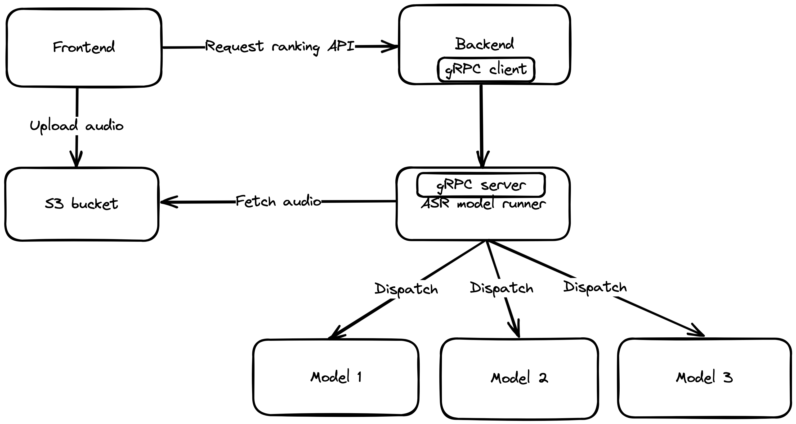

# Yetien

## Overview

This project is the ASR model server with a gRPC server

information about the project:

* Group number: 6
* Group name: Yeti
* Group members: Jianxuan Li, Dongpeng Dai, Jiffy Kuriakose
* Project name: Yetien
* Mentor name: Michael Stacey
* Project website: https://yetien.com/

## Technical details

### Design

### Technologies used

* Python
* gRPC
* Docker
* Kubernetes
* AWS S3
* Redis

## Development

System: Windows(WSL2) / Linux / Mac

Prerequisites: Docker installed

1. Clone the repo
1. Run `./dev up` to start the development and enter the development container
1. In the dev-container, run `./poetry install` to install the dependencies
1. In the dev-container, run `./dev run` to start the model server
3. Run `./dev down` to stop the development

